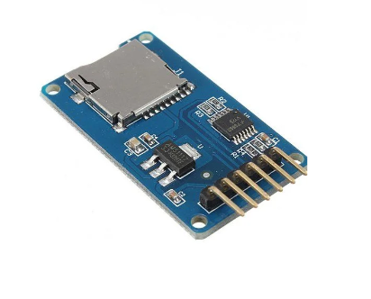
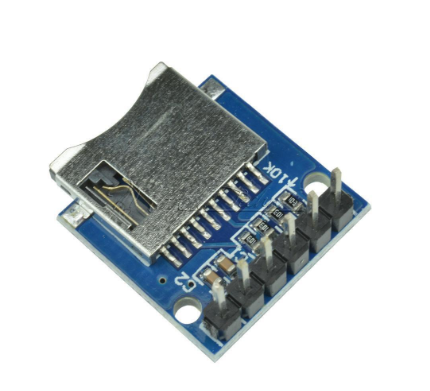

## Setting up

You will need a Raspberry Pi Pico, a computer with USB connection and to download <a href="https://thonny.org/">Thonny IDE</a>. 

Once you have all of these, you may need to reflash the Raspberry Pi Pico if it is new. To do this hold down the bbotsel button and then connect the usb to the pico and computeer. Be sure to keep the button pressed in this time. Once it is connected it should come up with the boot menu. Drag the most <a href="https://circuitpython.org/board/raspberry_pi_pico/">recent download of circuitpython</a> for Pico into the folder. 

See <a href="https://learn.adafruit.com/getting-started-with-raspberry-pi-pico-circuitpython/circuitpython">this tutorial</a> for more detail.

## Wiring
To wire up your data logger you will need to select sensors you want to read from, SD card reader (optional), breadboard, buttons and Pico. 

First begin by placing each component you will be using on the breadboard so that the lines do not cross, we will use jumper wires to connect the electronics. 

### SD card
The SD card is optional, though if you do not use an SD card the device can not be connected to Thonny while you gather data, otherwise you will get an error stating:
```[bash]
Traceback (most recent call last): File "<stdin>", 
line 48, in <module> File "<stdin>", 
line 20, in __init__ 
RuntimeError: Cannot remount path when visible via USB.
```
If this happens, simply unplug the device and make sure your code is running on boot by saving it as ```code.py``` so that as soon as power goes into the device, it runs your program. If you are using a USB plugged into your laptop and it keeps reconnecting automatically to Thonny, close Thonny before gathering data and plugging the device in. Remember that the device has limited data sorage, so be sure to keep backing up the files on your PC. 

If you do have an SD card then it is wired as follows: 

<p align="center">
  
</p>

Different SD readers may have different power requriements. Below is a table that explains what should be wired to what.

ADD TABLE WITH SD CARDS AND POWER PINS
| SD card holder | Power requirement | Pin on Pico |
|------|-------|-------|
|  | 5V | VBUS |
|  | 3.3 | 3.3 |

### MPU6050 sensor 
The MPU6050 is a gyroscope, accelerometer and temperature sensor. We will be using this sensor to gather human movement datasets that we can later classify. 

<p align="center">
  
</p>

### Push button
We include the use of a push button to allow you to stop and start recording from the sensor to your file.

ADD IMAGE OF BUTTON

### LED
The LED is our user interface. On smart phones we have screens that tell us what is going on, but if we are trying to be low cost, low power consuming, we can use an LED to let us know if we are recording data or not. 

ADD IMAGE OF LED